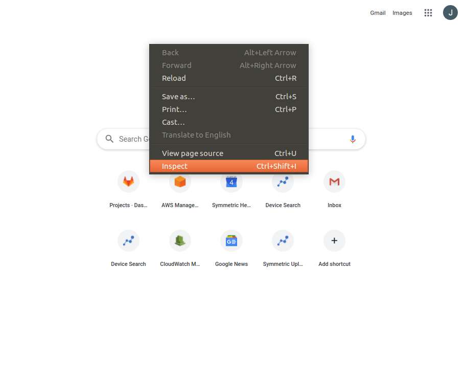
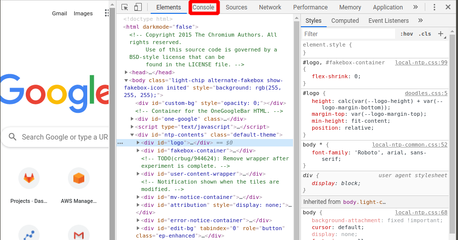
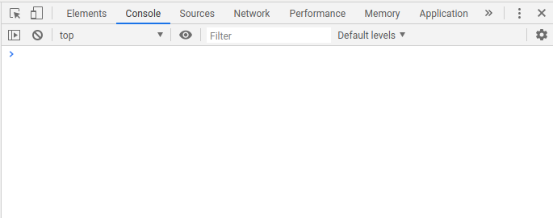
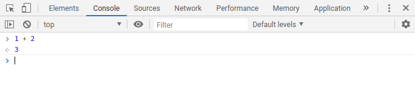

# The Basics
## Run some stuff somewhere
If you want to do anything big, you've got to get the basics down. One of the
easiest ways to start playing with javascript is via a browser console. For 
these tutorials, we will use the Chrome browser. To open a console:
 
 1. Go to any page in Chrome
 2. Right click on the page
    
 3. Select `Inspect Element`
 4. Go to the `Console` tab in the Developer Tools
    
 5. You should then see a prompt where we'll be able to type in javascript directly:
    
 6. In this console you can type any javascript command. For the rest of the tutorial
    we will be formatting commmands like this:
    ```
    >> 1 + 2
    = 3
    ```
    In the console, that would look like the following:
    
    You press enter after typing `1 + 2` and it evaluates to 3. 
  7. You can break up a command across multiple lines by pressing `Shift + Enter`
     instead of just `Enter` in the console:
     ```
     >> 1 + 
     2
     = 3
     ```
    
## Stuff Like Code
Now that we have somewhere to run things, we can go through the basics of
what javascript can do.

### Math
We've already seen it above, but you can do math like addition, subtraction, etc. Boring.

### Variables
You can save values into variables, so you can use them later or save intermediate
results.
```
>> let x = 3;
x + x
= 6
```
```
>> let y = 2;
x + y
= 5
```
```
>> x = 5;
x + y
= 7
```
Note how you can change the value of a variable and the same expression `x + y`
produces a different value.

The first time you use a variable you should use the `let` keyword. This
tells the console that you want to use a new variable with that name. Without
the `let` keyword, everything will still work, but you might accidentally change
the value of an existing variable you thought was new! With `let` you would get an
error:
```
>> let v = 1;
let v = 1;
VM83:1 Uncaught SyntaxError: Identifier 'x' has already been declared
    at <anonymous>:1:1
```

### Strings
Besides numbers, you can also use strings (a sequence of characters) in javascript.
```
>> let s = 'my string';
s
= 'my string'
```
You can concatenate strings as well:
```
>> s = s + ' more string'
s
'my string more string'
```
When you are writing strings, you can use double- or single-quotes. `'s'` and `"s"` are the same.

### If statements
To start doing actually useful work, you might need some logic. Javascript has `if` statements
to help with this:
```
>> if (1 === 1){
      x = 3
   } else {
      x = 4
   }
   x
= 3
```
The first section runs if the condition `1 === 1` is true, and the second `else` section runs
if it is false. In javascript, you should generally use `===` to see if things are equal 
and `!==` to see if things are not equal. You could also use `==` and `!=` but they say things
are equal at unexpected times (e.g. the string `'1'` will equal the number `1` with `==` 
but it won't be equal with `===`) so I'd stick with `===` and `!==`.

Sometimes you want to check multiple conditions at the same time. For that you can use the
and (`&&`) and or (`||`) operators. 

For the example below, I've added a comment after the
code. The comment starts with `//` and acts like a note in the code for anyone who reads it.
It doesn't run and has no effect on what the code does.
```
>> 1 === 1 && 1 === 2 // 1 equals 1 AND 1 equals 2
= false
```
```
>> 1 === 1 || 1 === 2 // 1 equals 1 OR 1 equals 2
= true
```
